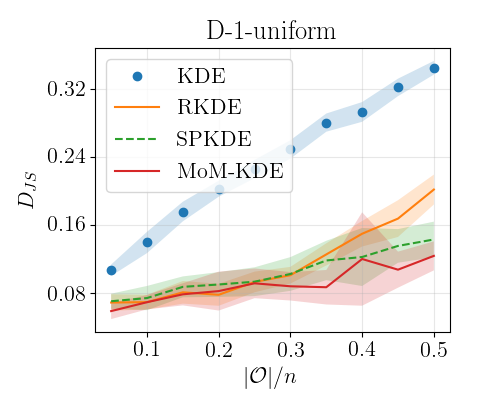

# Median-of-Means Kernel Density Estimator (MoM-KDE)

Code of the Median-of-Means Kernel Density Estimator (MoM-KDE) used in:

[Robust Kernel Density Estimation with Median-of-Means principle.](https://arxiv.org/abs/2006.16590)

## Container

The reposity contains codes for MoM-KDE, RKDE [1], and SPKDE [2].

## Requirements

This code runs on Python >= 3.5. Set up environment with:
```
pip install -r requirements.txt
```

## Usage
Results rely on several runs over either real or synthetic data.
For this purpose, there are three scripts to use.
### 1. `compare_kde_methods.py`
Runs MoM-KDE and other robust KDEs over **real** data.  
Scores are saved as a CSV in *outputs/scores/*.    
One can select the datasets to be tested and several other parameters (see 'Parameters' section in script).
### 2. `compare_kde_methods_synth.py`
Runs MoM-KDE and other robust KDEs over **synthetic** data.  
Scores are saved as a CSV in *outputs/scores/*.
One can select the synthetic schemes to be tested and several other parameters (see 'Parameters' section in script).
### 3. `plot_results.py`
Display results of selected dataset and metric (see 'Parameters' section in script)

For example, running successively `compare_kde_methods.py` and
`plot_results.py` yields the following plots:


Likewise, running `compare_kde_methods_synth.py` and `plot_results.py` (changing
the 'Parameters' section so that the synthetic dataset is selected and the Jensen divergence is displayed) yields:



## References
[1] J. Kim and C. D. Scott. Robust kernel density estimation. *Journal of Machine Learning Research*, 13(Sep):2529–2565, 2012.
[[link]](http://www.jmlr.org/papers/volume13/kim12b/kim12b.pdf)

[2] R. A. Vandermeulen and C. Scott. Robust kernel density estimation by scaling and projection in hilbert space. *In Advances in Neural Information Processing Systems*, pages 433–441, 2014.
[[link]](https://papers.nips.cc/paper/5228-robust-kernel-density-estimation-by-scaling-and-projection-in-hilbert-space.pdf)
